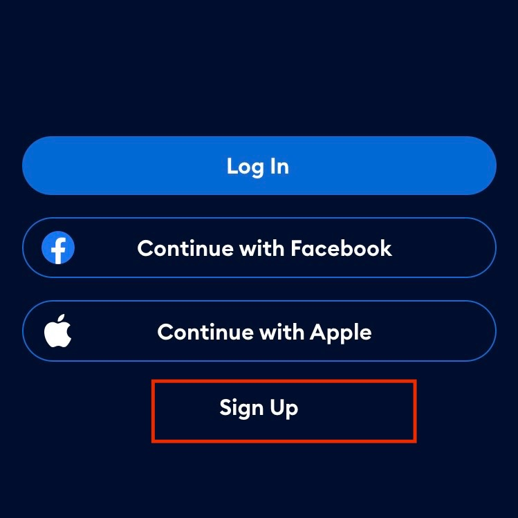

# Create an Account

Complete the following steps to create an account:

1. From the landing screen, select the profile button.
 
 

2. Select **Log In or Sign Up**.
3. If you have a Facebook account or an Apple account, you can use those credentials to create an account. Otherwise, select **Sign Up** to sign up with your email address.
 
 

4. Enter your first name, last name, email address, and a password. Ensure that the password is at least eight characters long and contains the following characters:
   - One uppercase letter
   - One lowercase letter
   - One number

5. Select the checkbox to indicate that you understand you might need to show identification to enter a venue.
 
 

6. Read the **Terms and Conditions** and the **Privacy Policy**. If you agree to the terms, select **Create Account**.
7. Access your email inbox and view the email that we sent you. Select **Verify Email**. A confirmation message is displayed in your browser.
8. After you have verified your email, in the AXS app, select **Continue**.
 
 

9. Enter your telephone number. Then, select **Send Code Via Text** to verify your account.
10. Enter the six-digit code sent to your phone.
 
 

Your account is now created, and you are ready to [navigate the app]({{ site.baseurl }}/navigate_app), [search for an event]({{ site.baseurl }}/search_for_event), and [buy tickets]({{ site.baseurl }}/buy_tickets)!